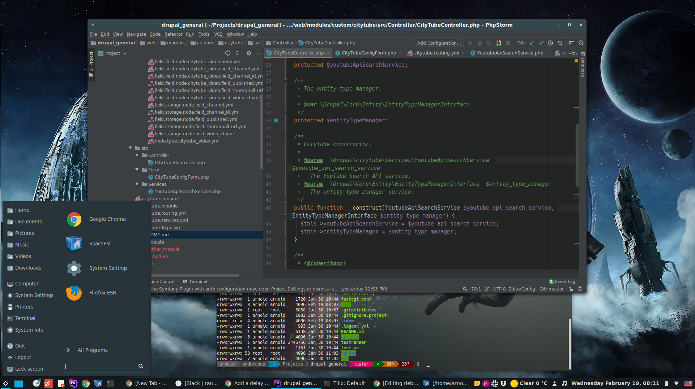

# Some useful stuff for a ~~Debian 9~~ Debian 10 + Cinnamon system 

**Note: most of this will probably work for Debian 9 as well, but don't depend your life on it.**



## First of all, add your user to sudoers

```
su
nano /etc/sudoers
```
Add `ALL=(ALL:ALL) ALL` to your user.

## Install CURL (you'll probably need it later)

```
sudo apt-get install curl
```

## Install Wget (software package for retrieving files)

```
sudo apt-get install wget
```

## Install dirmngr (network certificate management service)

```
sudo apt-get install dirmngr
```

## Add additional source lists

/etc/apt/sources.list

Add `contrib` and `non-free` to these lines:

```
deb http://ftp.de.debian.org/debian/ buster main contrib non-free
deb-src http://ftp.de.debian.org/debian/ buster main contrib non-free
```
Update.
```
sudo apt-get update
```

## Mount a HD on boot

Edit `/etc/fstab`

```
/dev/sdb2	/media/username/data	ext4	defaults	0	1
```

## Global execution for scripts in Bash

### Version 1

`sudo cp myscript.sh /usr/local/bin`

### Version 2

Edit `~/.bashrc`

Add
```
export PATH="$PATH:~/the/path/to/bin"
```
Refresh.
`source ~/.bashrc`


## GUI/Cinnamon stuff (my personal preference)

Theme: __Adapta Nokto Eta__ (System Settings > Themes > Desktop)\
Buttons: __Adwaita__ (System Settings > Themes > Buttons)\
Icons: __[Paper](https://snwh.org/paper)__\
Mouse Pointer: __Adwaita__ (System Settings > Themes > Mouse Pointer)\
Fonts: __[Hack](https://github.com/source-foundry/Hack), [Roboto](https://fonts.google.com/specimen/Roboto), [Open Sans](https://fonts.google.com/specimen/Open+Sans), [Cantarrel](https://fonts.google.com/specimen/Cantarell), [Inter UI]( https://rsms.me/inter/)__ (copy to `~/.fonts`)\
Window borders: __[Afflatus](https://www.gnome-look.org/p/1191004/)__  (copy to `~/.themes`)\
Extension: __Custom Shadows__ (doesn't work on newer versions of Cinnamon, however, I've made it work once, so I'll get back to it later)

Ubuntu fonts:

```
wget http://mirrors.kernel.org/ubuntu/pool/main/u/ubuntu-font-family-sources/ttf-ubuntu-font-family_0.80-0ubuntu6_all.deb
sudo dpkg -i ttf-ubuntu-font-family_0.80-0ubuntu6_all.deb
```

MS fonts:
```
sudo apt-get install ttf-mscorefonts-installer
```

Gnome Tweak Tools:
```
sudo apt-get install gnome-tweak-tool
```

## Essential software

Note: make sure that if you add new items into "Startup applications", you set them at least 10-15s delay, as some applications won't start before the Cinnamon GUI and some of its deamons are fully loaded.

#### Git (version-control system)

```
sudo apt-get install git
```

#### SpaceFM (visual file manager)

A feature-rich multi-panel tabbed file and desktop manager.

https://github.com/IgnorantGuru/spacefm/wiki/Distros

```
sudo apt-get install spacefm udevil
```

#### Midnight Commander (visual file manager)

```
sudo apt-get install mc
```

#### Tilix (tiling terminal emulator)

https://gnunn1.github.io/tilix-web/

```
sudo apt-get install tilix
```

#### Powerline Shell (a beautiful and useful prompt for your shell)

https://github.com/b-ryan/powerline-shell

#### Infinality (improved font rendering)

https://www.linuxbabe.com/desktop-linux/improve-font-rendering-on-debian-8-by-install-infinality-and-google-fonts

```
sudo apt-key adv --keyserver keyserver.ubuntu.com --recv-keys E985B27B
sudo apt-get update
sudo apt-get install fontconfig-infinality
```

## Non-essential, but useful software

#### KeePassXC

https://keepassxc.org/

```
sudo apt-get install keepassxc
```

#### XnView (photo viewer)

https://www.xnview.com/en/xnviewmp

#### Fancontrol (fan speed control)

https://askubuntu.com/questions/22108/how-to-control-fan-speed

My settings in `/etc/fancontrol` (could vary from system to system): 
```
MINTEMP=hwmon3/device/pwm2=20 hwmon1/device/pwm1=30
MAXTEMP=hwmon3/device/pwm2=70 hwmon1/device/pwm1=70
MINSTART=hwmon3/device/pwm2=150 hwmon1/device/pwm1=50
MINSTOP=hwmon3/device/pwm2=100 hwmon1/device/pwm1=40
```
#### Telegram (messenger)

```
sudo apt-get install telegram-desktop
```

#### Simplenote (note taking app)

https://github.com/Automattic/simplenote-electron

#### Imwheel (improved mouse-wheel control)

```
sudo apt-get install imwheel
```
Edit the config:
```
sudo nano ~/.imwheelrc
```
Paste this into the text file:
```
".*"
None,      Up,   Button4, 3
None,      Down, Button5, 3
Control_L, Up,   Control_L|Button4
Control_L, Down, Control_L|Button5
Shift_L,   Up,   Shift_L|Button4
Shift_L,   Down, Shift_L|Button5
```
Start `imwheel`:
```
imwheel --kill --buttons "4 5"
```
Don't forget to add it to the Startup Applications!

#### Node.js and npm

https://linuxize.com/post/how-to-install-node-js-on-debian-9/

#### WoeUSB (create your own usb stick Windows installer)

http://ppa.launchpad.net/nilarimogard/webupd8/ubuntu/pool/main/w/woeusb/

#### Flameshot (powerful yet simple to use screenshot software)

```
sudo apt-get install flameshot
```

#### htop (interactive system-monitor)

```
sudo apt-get install htop
```

#### GParted (disk partitioning)

```
sudo apt-get install gparted
```

#### Kazam (screencasting program)

```
sudo apt-get install kazam
```

#### VLC (media player)

```
sudo apt-get install vlc
```

#### OpenShot (video editor)

```
https://www.openshot.org/
```

#### qBittorrent (bittorrent client)

```
sudo apt-get install qbittorrent
```

#### VICE (Commodore emulator)

```
sudo apt-get install vice
```
Since the Debian distribution doesn't contains any ROMs, just download the Windows version from http://vice-emu.sourceforge.net/ and unpack the desired machine folder to `~/.vice` or `/usr/lib/vice`

You could attach [this Action Replay cartridge file](action_replay_7.5.crt) if your need it.

#### Insomnia (REST client)

https://support.insomnia.rest/article/23-installation#ubuntu

#### Kdenlive (non-linear video editor)

https://kdenlive.org/en/
```
sudo apt-get install kdenlive
```

#### Webcamoid (webcam suite)

https://webcamoid.github.io/
```
sudo apt-get install webcamoid
```

#### Wine32

```
echo -e "deb http://http.kali.org/kali sana main non-free contrib\ndeb http://security.kali.org/kali-security/ sana/updates main contrib non-free" > /etc/apt/sources.list
sudo apt-get update
sudo apt-get install wine32
```

## Small hacks

#### Fix the green antialias in Gimp

Uninstall Gimp (just kidding).

```
sudo gedit /etc/gimp/2.0/fonts.conf
```
```
<fontconfig>
 <match target="font">
  <edit name="rgba" mode="assign">
   <const>none</const>
  </edit>
 </match>
</fontconfig>
```

## General useful commands in Linux

#### List installed packages

```
 apt list --installed
 dpkg-query -l
```

#### Create a file of a specific size

This will create a file with 10-megabyte size filled with zeros.

```
dd if=/dev/zero of=out.txt bs=1M count=10
```

#### Copy files from via SSH

It's possible that `scp` needs to be installed first with `sudo apt-get install scp`.
```
scp username@source.server:source_file target_file
```
